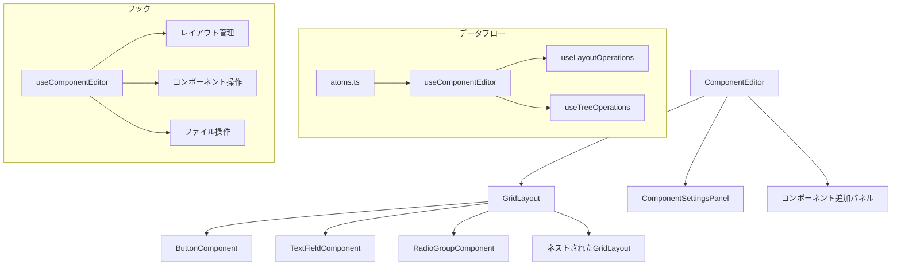
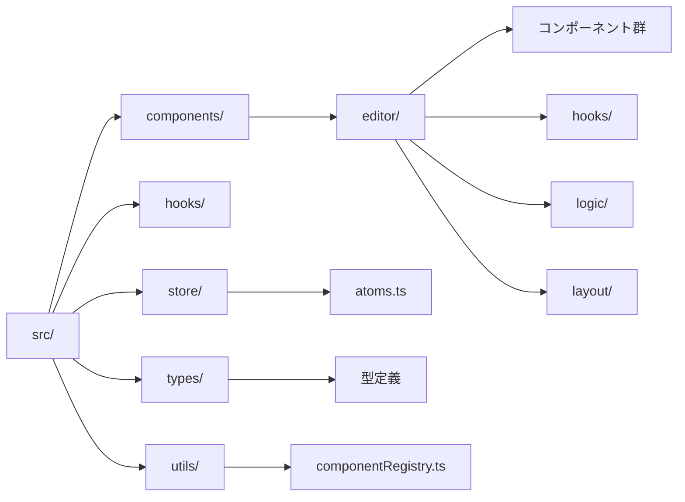

# RGLコンポーネントエディタ

## 概要

このプロジェクトは、React Grid Layoutを利用したインタラクティブなグリッドレイアウトエディタです。
ドラッグ＆ドロップで自由にレイアウトを編集でき、コンポーネントのネスト構造にも対応しています。

## アプリケーション構造

### コンポーネント構成


### ディレクトリ構造


## 必要要件

- Node.js 18.0.0以上
- pnpm 8.0.0以上

## インストール

```bash
# パッケージのインストール
pnpm install
```

## 開発サーバーの起動

```bash
# 開発サーバーを起動
pnpm dev
```

## ビルド

```bash
# プロダクション用にビルド
pnpm build
```

## 新しいコンポーネントを利用できるようにする方法

新しいコンポーネントをプロジェクトに追加するには、以下の手順を順番に実行してください。
各ステップは前のステップに依存するため、この順序で実装することが推奨されます：　

0. **実際のソースコードで処理を把握**
   - ButtonComponentとTextFieldComponentの実装を参考にして、共通部分や類似部分を確認し、必要な修正の概要を把握する 

1. **型定義の追加**
   - `src/types/index.ts` に新しいコンポーネントの型定義を追加します。
   ```typescript
   export type ComponentType = 'button' | 'gridLayout' | 'textField' | 'radioGroup' | 'newComponent';

   export interface NewComponentProps extends BaseLayoutProps {
     label: string;
     variant: 'outlined' | 'contained';  // コンポーネント固有のプロパティを追加
   }
   ```

2. **コンポーネントの実装**
   - `src/components/editor/NewComponent.tsx` に新しいコンポーネントを実装します。
   ```tsx
   import React from 'react';
   import { Box, Button } from '@mui/material';
   import type { NewComponentProps, BaseComponent } from '../../types';
   import { CommonLayoutSettings } from './common/CommonLayoutSettings';

   const NewComponent: BaseComponent<NewComponentProps> = {
     render: (props: NewComponentProps) => {
       const { label, variant } = props;
       return (
         <Box sx={{ width: '100%', height: '100%', display: 'flex', alignItems: 'center', justifyContent: 'center' }}>
           <Button variant={variant}>{label}</Button>
         </Box>
       );
     },

     renderSettings: (props: NewComponentProps, onUpdate: (newProps: Partial<NewComponentProps>) => void) => {
       return (
         <Box sx={{ display: 'flex', flexDirection: 'column', gap: 1.5 }}>
           <CommonLayoutSettings props={props} onUpdate={onUpdate} />
           <input
             type="text"
             value={props.label}
             onChange={(e) => onUpdate({ label: e.target.value })}
           />
           <select
             value={props.variant}
             onChange={(e) => onUpdate({ variant: e.target.value as 'outlined' | 'contained' })}
           >
             <option value="outlined">枠線付き</option>
             <option value="contained">塗りつぶし</option>
           </select>
         </Box>
       );
     },
   };

   export default NewComponent;
   ```

3. **コンポーネントの登録**
   - `src/utils/componentRegistry.ts` に新しいコンポーネントを登録します。
   ```typescript
   import NewComponent from '../components/editor/NewComponent';

   const defaultNewComponentProps: NewComponentProps = {
     label: '新しいコンポーネント',
     variant: 'outlined',
     widthPercentage: 80,
     heightPercentage: 50,
     horizontalAlign: 'center',
     verticalAlign: 'center',
   };

   componentRegistry.registerComponent('newComponent', {
     displayName: '新しいコンポーネント',
     icon: createElement(AddBoxIcon),
     defaultWidth: 2,
     defaultHeight: 1,
     defaultProps: defaultNewComponentProps,
   });
   ```

4. **設定パネルへの追加**
   - `src/components/editor/ComponentSettingsPanel.tsx` に新しいコンポーネントを設定パネルに追加します。
   ```tsx
   import NewComponent from './NewComponent';

   const componentMap = {
     button: ButtonComponent,
     textField: TextFieldComponent,
     gridLayout: GridLayoutComponent,
     radioGroup: RadioGroupComponent,
     newComponent: NewComponent, // 新しいコンポーネントを追加
   };
   ```

5. **プロパティ更新ロジックの追加**
   - `src/hooks/useLayoutOperations.ts`に新しいコンポーネントの更新処理を追加します。
   ```typescript
   // 型インポートに追加
   import { NewComponentProps } from '../types';

   // updateItemPropsのswitch文に追加
   case 'newComponent':
     updatedComponent.props = {
       ...updatedComponent.props,
       ...(newProps as Partial<NewComponentProps>)
     } as NewComponentProps;
     break;
   ```

6. **エディタへの追加**
   - `src/components/editor/ComponentEditor.tsx` で以下の3つの実装を行います。

   ```tsx
   // 1. コンポーネント追加ボタンの実装
   const AddComponentButton: React.FC<{
     icon: ReactNode;
     label: string;
     onClick: () => void;
   }> = ({ icon, label, onClick }) => (
     <Button
       variant="outlined"
       fullWidth
       onClick={onClick}
       startIcon={icon}
     >
       {label}を追加
     </Button>
   );

   // 2. ハンドラー関数の実装
   const handleAddNewComponent = () => {
     handleAddComponent('newComponent');
   };

   // 3. ツールバーへの追加（Toolbarコンポーネント内）
   <Box sx={{ display: 'flex', gap: 1, p: 1 }}>
     <AddComponentButton
       icon={<AddBoxIcon />}
       label="新しいコンポーネント"
       onClick={handleAddNewComponent}
     />
     {/* 他のボタンコンポーネント */}
   </Box>
   ```

6. **動作確認**
   - プロジェクトを起動し、エディタ画面で「XXXを追加」ボタンをクリック。
   - グリッドに `NewComponent` が追加され、設定パネルでプロパティを編集できることを確認します。

これにより、エディタのツールバーに新しいコンポーネントを追加するボタンが表示され、クリック時にコンポーネントが追加されます。handleAddComponentはグリッドレイアウトにコンポーネントを配置するための内部関数です。
これで、新しいコンポーネントが他のコンポーネントと同様に扱えるようになります。

## コンポーネント設定のUIガイドライン

プロパティ設定のUIコンポーネントは、以下の方針に基づいて選択します：

### 入力形式の選択基準

1. **テキストボックス / 数値入力**
   - 自由な数値入力が必要な項目（例：spacing）
   - 単位付きの数値入力（例：rem単位の値）
   - カスタムテキスト入力（例：ラベル文字列）

2. **スライダー**
   - 一定範囲内の数値設定（例：0-100%のサイズ指定）
   - 視覚的なフィードバックが有効な項目
   - 細かい数値指定が不要な項目

3. **ドロップダウンリスト（Select）**
   - 3つ以上の選択肢がある項目
   - 事前に定義された値から選択する項目
   - 例：alignItems、justifyContent等の複数の固定値

4. **トグルスイッチ（Switch）**
   - ON/OFF形式の設定項目
   - 真偽値で切り替える設定
   - 例：折り返し設定（wrap/nowrap）

### 実装例

```typescript
// スライダーの実装例（0-100%の範囲）
<Slider
  value={props.widthPercentage}
  min={1}
  max={100}
  onChange={(_, value) => onUpdate({ widthPercentage: value })}
  valueLabelDisplay="auto"
  size="small"
/>

// ドロップダウンリストの実装例（3つ以上の選択肢）
<Select
  value={props.alignItems}
  onChange={(e) => onUpdate({ alignItems: e.target.value })}
  label="アイテムの配置"
>
  <MenuItem value="flex-start">上/左</MenuItem>
  <MenuItem value="center">中央</MenuItem>
  <MenuItem value="flex-end">下/右</MenuItem>
  <MenuItem value="stretch">広げる</MenuItem>
</Select>

// トグルスイッチの実装例（ON/OFF設定）
<FormControlLabel
  control={
    <Switch
      checked={props.wrap === 'wrap'}
      onChange={(e) => onUpdate({ wrap: e.target.checked ? 'wrap' : 'nowrap' })}
    />
  }
  label="折り返し"
/>
```

この方針に従うことで、一貫性のある使いやすいUIを提供できます。

## 技術スタック

- React
- TypeScript
- Material-UI
- react-grid-layout
- Vite
- ESLint
