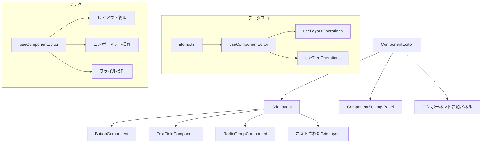
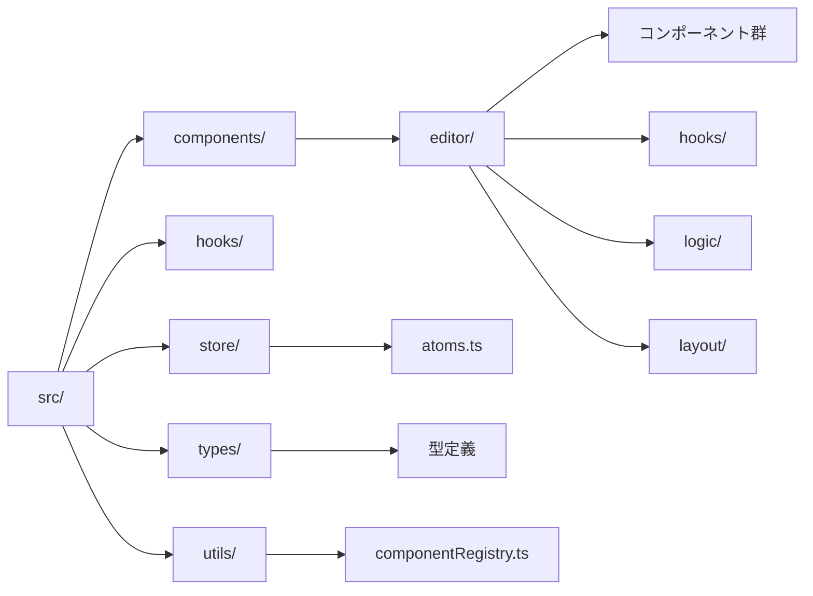
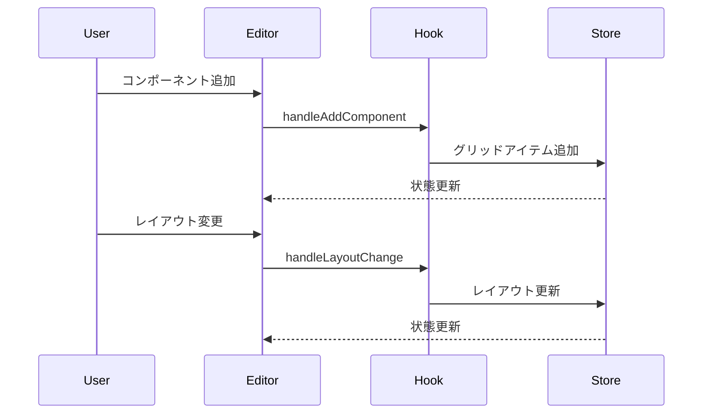

# グリッドレイアウトエディタ

## 概要

このプロジェクトは、React Grid Layoutを利用したインタラクティブなグリッドレイアウトエディタです。
ドラッグ＆ドロップで自由にレイアウトを編集でき、コンポーネントのネスト構造にも対応しています。

## アプリケーション構造

### コンポーネント構成


### ディレクトリ構造


### 操作フロー


## 主な機能

- グリッドレイアウトの動的な編集
- コンポーネントのドラッグ＆ドロップ配置
- サイズ変更可能なグリッドアイテム
- 最大5階層までのネスト構造
- レイアウト設定のインポート/エクスポート
- 各種コンポーネントの追加と設定
  - コンポーネントの新規配置
  - サイズや表示内容の設定

## 必要要件

- Node.js 18.0.0以上
- pnpm 8.0.0以上

## インストール

```bash
# パッケージのインストール
pnpm install
```

## 開発サーバーの起動

```bash
# 開発サーバーを起動
pnpm dev
```

## ビルド

```bash
# プロダクション用にビルド
pnpm build
```

## 使用方法

### 基本操作

1. **領域の追加**
   - コンポーネント追加パネルの「グリッドレイアウト」ボタンをクリックして新しいグリッド領域を追加
   - ドラッグで位置を移動可能
   - 右下のハンドルでサイズを変更可能

2. **各種コンポーネントの追加**
   - コンポーネント追加パネルの「XXXコンポーネント」ボタンをクリックしてXXXコンポーネントを追加
   - 右側のパネルで以下の設定を編集可能：
     - サイズと配置の調整
     - コンポーネントごとに特有のpropsの調整


3. **編集モード**
   - 領域を選択して「領域内を編集」ボタンをクリックすると、その領域内のみを編集可能
   - 「領域内の編集終了」で編集モードを終了

4. **削除**
   - 要素を選択して「選択した領域を削除」ボタンをクリック

### インポート/エクスポート

- 「エクスポート」ボタンでレイアウト設定をJSONファイルとして保存
- 「インポート」ボタンで保存したレイアウト設定を読み込み

## このプロジェクトに新しいコンポーネントを追加する方法

新しいコンポーネントをプロジェクトに追加するには、以下の手順を順番に実行してください。
各ステップは前のステップに依存するため、この順序で実装することが推奨されます：

1. **型定義の追加**
   - `src/types/index.ts` に新しいコンポーネントの型定義を追加します。
   ```typescript
   export type ComponentType = 'button' | 'gridLayout' | 'textField' | 'radioGroup' | 'newComponent';

   export interface NewComponentProps extends BaseLayoutProps {
     label: string;
     variant: 'outlined' | 'contained';  // コンポーネント固有のプロパティを追加
   }
   ```

2. **コンポーネントの実装**
   - `src/components/editor/NewComponent.tsx` に新しいコンポーネントを実装します。
   ```tsx
   import React from 'react';
   import { Box, Button } from '@mui/material';
   import type { NewComponentProps, BaseComponent } from '../../types';
   import { CommonLayoutSettings } from './common/CommonLayoutSettings';

   const NewComponent: BaseComponent<NewComponentProps> = {
     render: (props: NewComponentProps) => {
       const { label, variant } = props;
       return (
         <Box sx={{ width: '100%', height: '100%', display: 'flex', alignItems: 'center', justifyContent: 'center' }}>
           <Button variant={variant}>{label}</Button>
         </Box>
       );
     },

     renderSettings: (props: NewComponentProps, onUpdate: (newProps: Partial<NewComponentProps>) => void) => {
       return (
         <Box sx={{ display: 'flex', flexDirection: 'column', gap: 1.5 }}>
           <CommonLayoutSettings props={props} onUpdate={onUpdate} />
           <input
             type="text"
             value={props.label}
             onChange={(e) => onUpdate({ label: e.target.value })}
           />
           <select
             value={props.variant}
             onChange={(e) => onUpdate({ variant: e.target.value as 'outlined' | 'contained' })}
           >
             <option value="outlined">枠線付き</option>
             <option value="contained">塗りつぶし</option>
           </select>
         </Box>
       );
     },
   };

   export default NewComponent;
   ```

3. **コンポーネントの登録**
   - `src/utils/componentRegistry.ts` に新しいコンポーネントを登録します。
   ```typescript
   import NewComponent from '../components/editor/NewComponent';

   const defaultNewComponentProps: NewComponentProps = {
     label: '新しいコンポーネント',
     variant: 'outlined',
     widthPercentage: 80,
     heightPercentage: 50,
     horizontalAlign: 'center',
     verticalAlign: 'center',
   };

   componentRegistry.registerComponent('newComponent', {
     displayName: '新しいコンポーネント',
     icon: createElement(AddBoxIcon),
     defaultWidth: 2,
     defaultHeight: 1,
     defaultProps: defaultNewComponentProps,
   });
   ```

4. **設定パネルへの追加**
   - `src/components/editor/ComponentSettingsPanel.tsx` に新しいコンポーネントを設定パネルに追加します。
   ```tsx
   import NewComponent from './NewComponent';

   const componentMap = {
     button: ButtonComponent,
     textField: TextFieldComponent,
     gridLayout: GridLayoutComponent,
     radioGroup: RadioGroupComponent,
     newComponent: NewComponent, // 新しいコンポーネントを追加
   };
   ```

5. **エディタへの追加**
   - `src/components/editor/ComponentEditor.tsx` で以下の3つの実装を行います。

   ```tsx
   // 1. コンポーネント追加ボタンの実装
   const AddComponentButton: React.FC<{
     icon: ReactNode;
     label: string;
     onClick: () => void;
   }> = ({ icon, label, onClick }) => (
     <Button
       variant="outlined"
       fullWidth
       onClick={onClick}
       startIcon={icon}
     >
       {label}を追加
     </Button>
   );

   // 2. ハンドラー関数の実装
   const handleAddNewComponent = () => {
     handleAddComponent('newComponent');
   };

   // 3. ツールバーへの追加（Toolbarコンポーネント内）
   <Box sx={{ display: 'flex', gap: 1, p: 1 }}>
     <AddComponentButton
       icon={<AddBoxIcon />}
       label="新しいコンポーネント"
       onClick={handleAddNewComponent}
     />
     {/* 他のボタンコンポーネント */}
   </Box>
   ```

   これにより、エディタのツールバーに新しいコンポーネントを追加するボタンが表示され、クリック時にコンポーネントが追加されます。handleAddComponentはグリッドレイアウトにコンポーネントを配置するための内部関数です。

6. **プロパティ更新ロジックの追加**
   - `src/hooks/useLayoutOperations.ts` に新しいコンポーネントのプロパティ更新ロジックを追加します。
   ```typescript
   case 'newComponent':
     updatedComponent.props = {
       ...updatedComponent.props,
       ...(newProps as Partial<NewComponentProps>),
     } as NewComponentProps;
     break;
   ```

7. **動作確認**
   - プロジェクトを起動し、エディタ画面で「XXXを追加」ボタンをクリック。
   - グリッドに `NewComponent` が追加され、設定パネルでプロパティを編集できることを確認します。

これで、新しいコンポーネントが他のコンポーネントと同様に扱えるようになります。

## 制限事項

- ネストは最大5階層まで
- グリッドは12x12サイズ
- コンポーネントは重ならないように配置される
- レイアウト系コンポーネントの中の要素がレイアウト自体のサイズを超えた場合、要素ごとにスクロールが発生する
  - グリッドレイアウトで作成したグリッドの縦横比は内側の要素の大きさに関わらず固定される
  - グリッドレイアウトはグリッドのサイズを超える要素がある場合はグリッドごとにスクロールが発生する
  - コンポーネント全体をまとめてスクロールさせたい場合は、１つの大きなcolStackで囲んだ上で、その中にstack系要素を配置すること

## 技術スタック

- React
- TypeScript
- Material-UI
- react-grid-layout
- Vite
- ESLint
