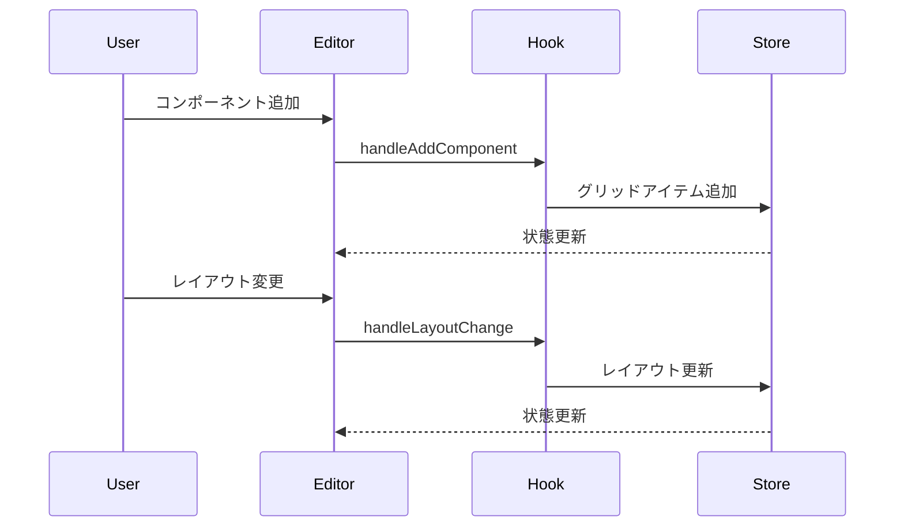

# RGLコンポーネントエディタ

## 概要

このプロジェクトは、React Grid Layoutを利用したインタラクティブなグリッドレイアウトエディタです。
ドラッグ＆ドロップで自由にレイアウトを編集でき、コンポーネントのネスト構造にも対応しています。


### 操作フロー


## 主な機能

- グリッドレイアウトの動的な編集
- コンポーネントのドラッグ＆ドロップ配置
- サイズ変更可能なグリッドアイテム
- 最大5階層までのネスト構造
- レイアウト設定のインポート/エクスポート
- 各種コンポーネントの追加と設定
  - コンポーネントの新規配置
  - サイズや表示内容の設定

## 必要要件

- Node.js 18.0.0以上
- pnpm 8.0.0以上

## インストール

```bash
# パッケージのインストール
pnpm install
```

## 開発サーバーの起動

```bash
# 開発サーバーを起動
pnpm dev
```

## ビルド

```bash
# プロダクション用にビルド
pnpm build
```

## 使用方法

### 基本操作

1. **領域の追加**
   - コンポーネント追加パネルの「グリッドレイアウト」ボタンをクリックして新しいグリッド領域を追加
   - ドラッグで位置を移動可能
   - 右下のハンドルでサイズを変更可能

2. **各種コンポーネントの追加**
   - コンポーネント追加パネルの「XXXコンポーネント」ボタンをクリックしてXXXコンポーネントを追加
   - 右側のパネルで以下の設定を編集可能：
     - サイズと配置の調整
     - コンポーネントごとに特有のpropsの調整


3. **編集モード**
   - 領域を選択して「領域内を編集」ボタンをクリックすると、その領域内のみを編集可能
   - 「領域内の編集終了」で編集モードを終了

4. **削除**
   - 要素を選択して「選択した領域を削除」ボタンをクリック

### インポート/エクスポート

- 「エクスポート」ボタンでレイアウト設定をJSONファイルとして保存
- 「インポート」ボタンで保存したレイアウト設定を読み込み

## 制限事項

- ネストは最大5階層まで
- グリッドは12x12サイズ
- コンポーネントは重ならないように配置される
- レイアウト系コンポーネントの中の要素がレイアウト自体のサイズを超えた場合、要素ごとにスクロールが発生する
  - グリッドレイアウトで作成したグリッドの縦横比は内側の要素の大きさに関わらず固定される
  - グリッドレイアウトはグリッドのサイズを超える要素がある場合はグリッドごとにスクロールが発生する
  - コンポーネント全体をまとめてスクロールさせたい場合は、１つの大きなcolStackで囲んだ上で、その中にstack系要素を配置すること
